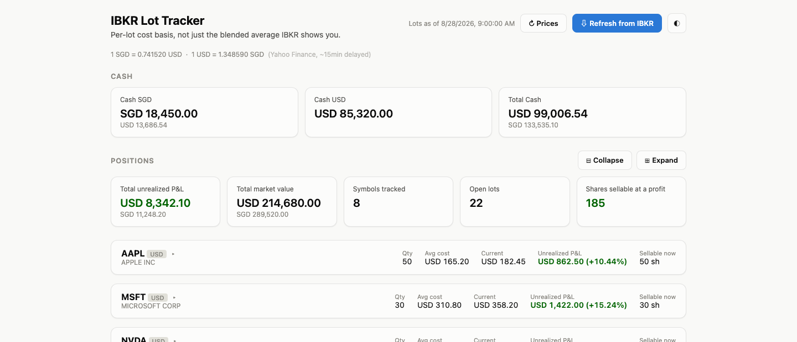
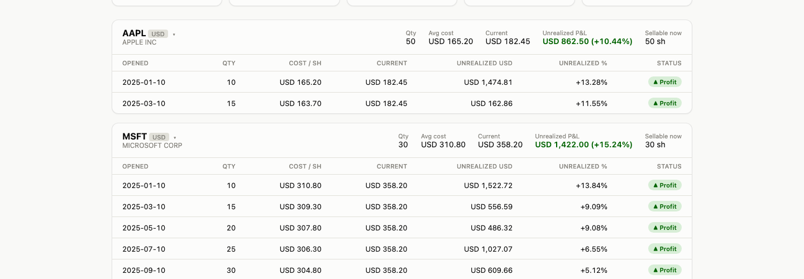
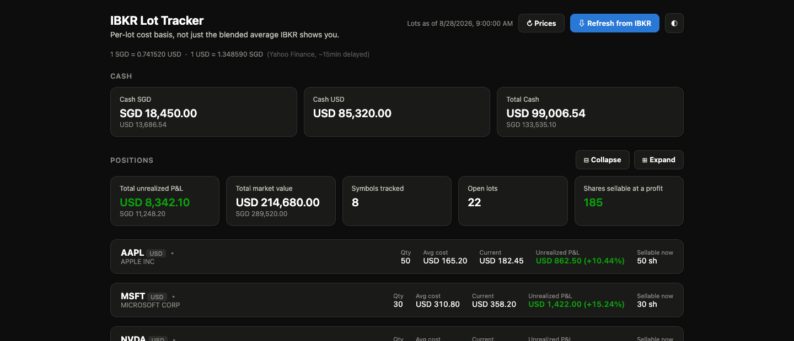

# IBKR Lot Tracker

> The per-lot breakdown that IBKR's own interface doesn't give you.

**IBKR does not show individual lot detail in its UI.** Every position appears as a single blended average cost — so if you bought AAPL at $150, $170, and $190, IBKR just shows you one average. You have no way to tell which lots are in profit and which are underwater without doing the math yourself.

This app pulls your raw lot data directly from IBKR's **Flex Web Service** (the same data IBKR uses internally, just not surfaced in their UI) and visualises every individual purchase lot — open date, cost per share, current price, unrealized P&L — so you can make informed sell decisions at a glance.

It also tracks cash balances and handles multi-currency accounts (USD + SGD out of the box).

Not affiliated with or endorsed by Interactive Brokers.

---



---

## Features

- **Per-lot breakdown** — open date, quantity, cost per share, unrealized P&L for every lot
- **Multi-currency** — native currency P&L with live USD/SGD FX conversion on every figure
- **Cash balances** — per-currency cash with cross-currency totals
- **Manual price override** — set a price for tickers Yahoo Finance can't find (e.g. SGX stocks); saved locally and persists across restarts
- **Auto-refresh** — prices every 60 s, IBKR report every 15 min, both in the background
- **Light & dark theme**, collapsible ticker cards, collapse/expand all

---

## What it looks like

### Lot detail (expanded)



### Dark mode



---

## Quick start

Requires **Python 3.9+**.

```bash
git clone <repo-url>
cd ibkr-lot-tracker

pip3 install -r requirements.txt

cp .env.example .env
# Edit .env — add your IBKR_FLEX_TOKEN and IBKR_FLEX_QUERY_ID (see setup below)

python3 run.py
```

Open **http://127.0.0.1:8000** and click **Refresh from IBKR**.

---

## IBKR setup (one time)

You need two things from IBKR: a **Flex Query** and a **Flex Web Service token**.

### Step 1 — Create a Flex Query

1. Log into [IBKR Client Portal](https://www.interactivebrokers.com/) → **Performance & Reports → Flex Queries**
2. Click **Configure with AI** and paste this prompt, or configure manually using the **+** button:

   > Create a Flex Query with two sections. Section 1: Open Positions, Level of Detail = Lot, fields: Symbol, Description, Asset Category, Currency, Position, Cost Basis Price, Open Date/Time, Mark Price, Side. Section 2: Cash Report, fields: Currency, Ending Cash, Ending Settled Cash. Format = XML. Period = Last 365 Calendar Days.

3. Save the query. Note the **Query ID** (number) shown next to it.

### Step 2 — Get your Flex Web Service token

1. On the same Flex Queries page, find **Flex Web Service Configuration** on the right → click the **⚙️** gear icon
2. Copy your **token** — treat it like a password. Regenerate it from the same screen if it ever leaks.

### Step 3 — Configure `.env`

```env
IBKR_FLEX_TOKEN=your_token_here
IBKR_FLEX_QUERY_ID=your_query_id_here
```

---

## Using the app

### Top bar controls

| Button | Action |
|---|---|
| **↻ Prices** | Refresh prices from Yahoo Finance now. Also auto-runs every 60 s. |
| **⇩ Refresh from IBKR** | Pull a fresh report from IBKR (takes 5–30 s). Rate-limited to once per 15 min. Also auto-runs every 15 min. |
| **◐** | Toggle light / dark theme |

Hover over either button to see a tooltip explaining the refresh cadence.

### Cash section

Cash balances per currency, with cross-currency equivalents and a combined total in both USD and SGD.

### Positions section

| Tile | Meaning |
|---|---|
| Total unrealized P&L | Across all positions in USD (SGD equivalent shown below) |
| Total market value | Current price × quantity in USD (SGD below) |
| Symbols tracked | Number of distinct tickers |
| Open lots | Total individual purchase lots |
| Shares sellable at a profit | Quantity where current price > cost basis |

Click any **ticker card header** to expand or collapse the lot table.
**Lots are sorted cheapest cost first** — those are furthest into profit and the natural candidates to sell first.

- **▲ Profit** — current price is above this lot's cost basis
- **▼ Hold** — selling now would realise a loss

### Setting prices manually

If a ticker shows `—` for current price (common for non-US listings, e.g. SGX-listed stocks), click **✎** in the card header, type the price in the stock's native currency, and press **Set**. The value is saved to the local database and survives restarts.

---

## Configuration

All options go in `.env` (copy from `.env.example`):

| Variable | Default | Description |
|---|---|---|
| `IBKR_FLEX_TOKEN` | — | **Required.** From Flex Web Service Configuration. |
| `IBKR_FLEX_QUERY_ID` | — | **Required.** Numeric ID of your Flex Query. |
| `FLEX_MIN_REFRESH_MINUTES` | `15` | Minimum minutes between IBKR fetches. |
| `DATABASE_PATH` | `./data/lots.db` | SQLite file for snapshots and price overrides. |
| `APP_HOST` | `127.0.0.1` | Host to bind the server to. |
| `APP_PORT` | `8000` | Port to bind the server to. |

---

## Notes & limitations

- **Prices are ~15 min delayed** (Yahoo Finance). Good for "which lots are broadly in profit" — not for precise trade timing.
- **Non-US tickers**: Yahoo Finance sometimes uses different symbols than IBKR (e.g. `CSPX.L` vs `CSPX`). Use the manual price override for these.
- **FX rates** are also from Yahoo Finance (`SGDUSD=X`), ~15 min delayed.
- **Read-only** — the app never places or modifies trades.
- **Single-user** — no authentication. Run locally or on a private network.
- If a field shows blank after your first refresh, open `http://127.0.0.1:8000/api/debug/raw-flex` to inspect the raw XML and add the attribute name to `FIELD_CANDIDATES` in `backend/flex_parser.py`.

---

## Running tests

```bash
pytest
```

---

## License

[MIT](LICENSE)
